# 🔥 Firewall Exploration Lab

## 📌 Overview

This lab explores Linux firewall technologies using **iptables**. The exercises demonstrate how to configure stateless and stateful firewalls, implement packet filtering policies, perform connection tracking, apply traffic rate limiting, and configure load balancing using NAT.

The lab provides hands-on experience with real-world firewall concepts used to protect networks and control traffic flow.

---

## 🎯 Objectives

- Configure stateless firewall rules
- Protect router and internal networks
- Secure internal servers using access control policies
- Analyze connection tracking behavior
- Implement stateful packet filtering
- Apply traffic rate limiting
- Configure NAT-based load balancing
- Understand packet forwarding decisions

---

# Protecting the Router

Configure firewall rules that block all traffic except ICMP echo requests and replies.

### Firewall Rules

```bash
iptables -A INPUT -p icmp --icmp-type echo-request -j ACCEPT
iptables -A OUTPUT -p icmp --icmp-type echo-reply -j ACCEPT
iptables -P OUTPUT DROP
iptables -P INPUT DROP
```

### Screenshot

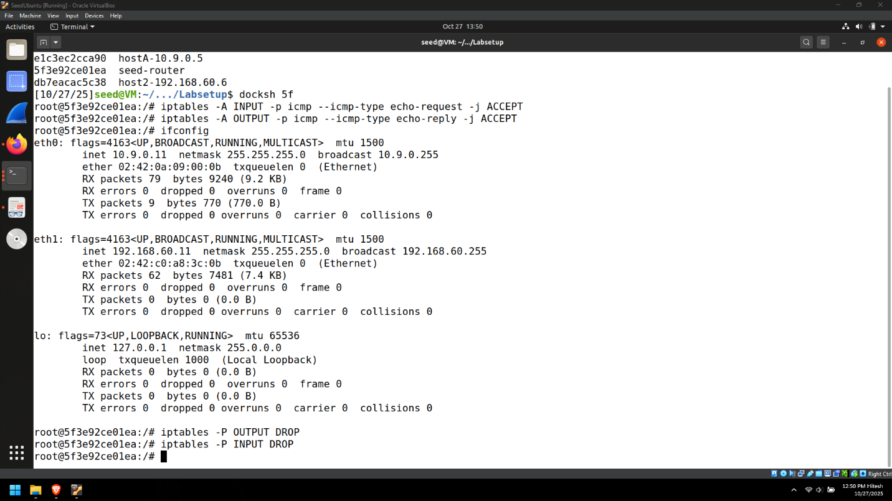

### Result

- Router responds to ping requests.
- Telnet and other traffic are blocked.
- Default policy drops unauthorized traffic.

---

# Verification

### Screenshot

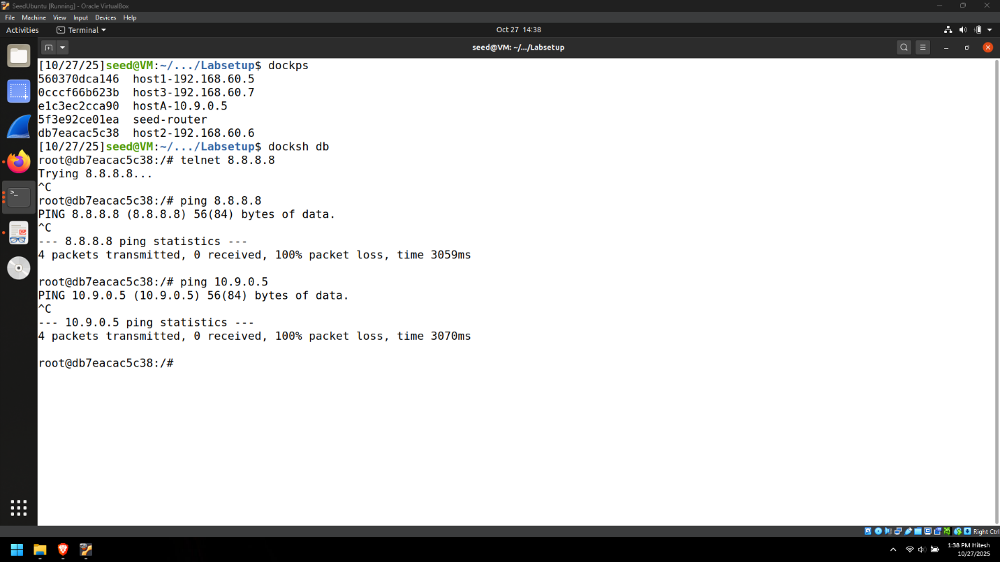

### Observation

- ICMP traffic succeeds.
- Telnet connection times out.
- Firewall enforces protocol-specific access.

---

# Securing the Internal Network

Configure forwarding rules to control ICMP communication between external and internal networks.

### Screenshot

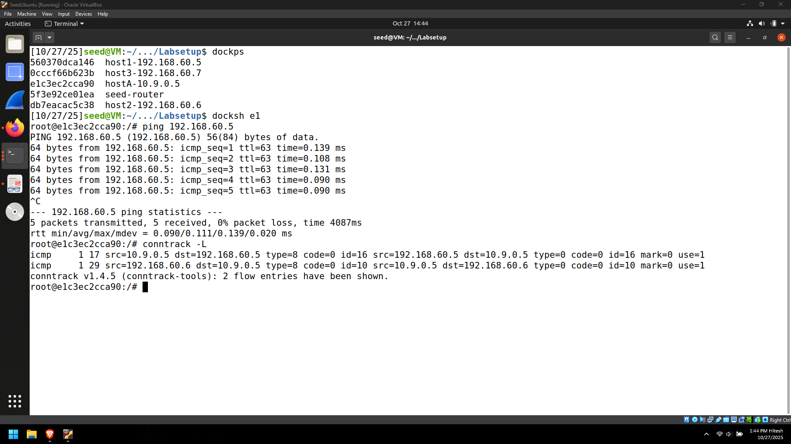

### Firewall Rules

```bash
iptables -A FORWARD -p icmp --icmp-type echo-request -i eth0 -o eth1 -j DROP
iptables -A FORWARD -p icmp --icmp-type echo-request -d 10.9.0.11 -j ACCEPT
iptables -A FORWARD -p icmp --icmp-type echo-request -i eth1 -o eth0 -j ACCEPT
iptables -A FORWARD -j DROP
```

### Result

- External hosts cannot ping internal hosts.
- External hosts can ping the router.
- Internal hosts can ping external hosts.
- All other forwarding traffic is blocked.

### Screenshot

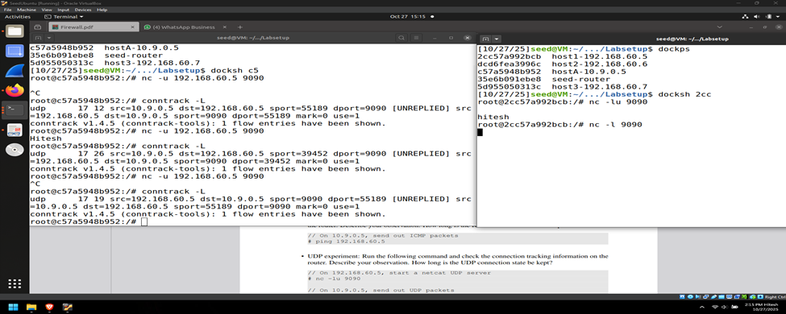

---

# Securing Internal Servers

Restrict external access to internal servers while allowing controlled access to a specific Telnet service.

### Firewall Rules

```bash
iptables -A FORWARD -i eth0 -d 192.168.60.5 -p tcp --dport 23 -j ACCEPT
iptables -A FORWARD -i eth0 -d 192.168.60.0/24 -j DROP
iptables -A FORWARD -i eth1 -s 192.168.60.0/24 -d 192.168.60.0/24 -j ACCEPT
iptables -A FORWARD -i eth1 -o eth0 -j DROP
```

### Screenshot

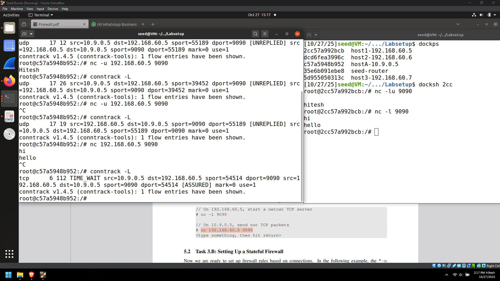

### Verification

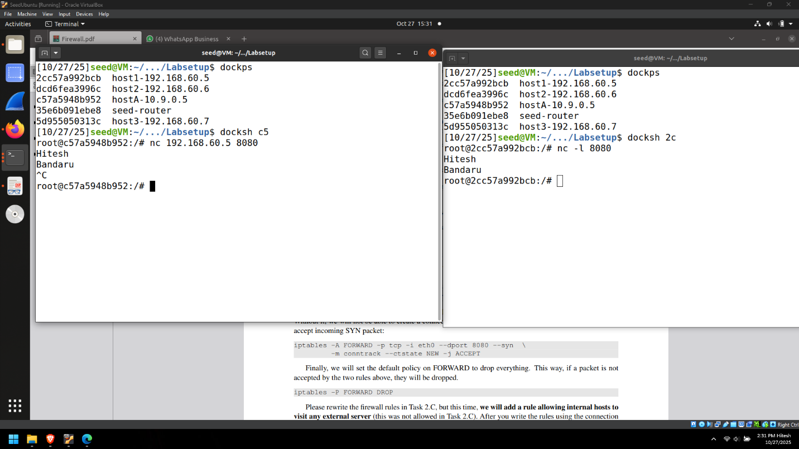

### Result

- External users can access only the Telnet server.
- Other internal servers remain protected.
- Internal hosts can communicate internally.
- Internal hosts cannot access external services.

---

# Connection Tracking

Investigate how Linux tracks ICMP, UDP, and TCP sessions.

### Screenshot

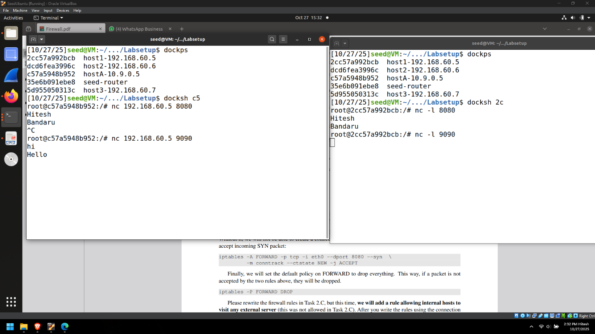

### Observations

#### ICMP

- Connection entries are created.
- Entries remain temporarily after ping stops.

#### UDP

- UDP sessions are tracked.
- Entries persist briefly before expiration.

#### TCP

- TCP entries remain longer due to connection states.

---

# Stateful Firewall

Implement state-aware packet filtering using connection tracking.

### Firewall Rules

```bash
iptables -A FORWARD -p tcp -m conntrack --ctstate ESTABLISHED,RELATED -j ACCEPT

iptables -A FORWARD -p tcp --syn -i eth0 \
--dport 8080 -m conntrack --ctstate NEW -j ACCEPT

iptables -P FORWARD DROP
```

### Screenshot

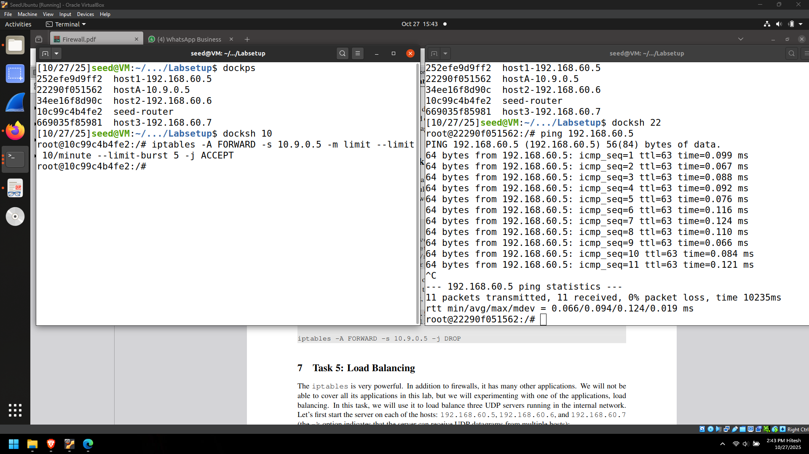

### Verification


### Result

- New connections allowed only on port 8080.
- Return traffic automatically permitted.
- Connections on other ports are blocked.

### Advantages

- Automatic handling of return traffic
- Supports dynamic protocols
- Simplified firewall configuration

### Disadvantages

- Additional memory and CPU usage
- More difficult troubleshooting

---

# Limiting Network Traffic

Apply packet rate limiting using iptables.

### Firewall Rules

```bash
iptables -A FORWARD -s 10.9.0.5 \
-m limit --limit 10/minute --limit-burst 5 -j ACCEPT

iptables -A FORWARD -s 10.9.0.5 -j DROP
```

### Without DROP Rule

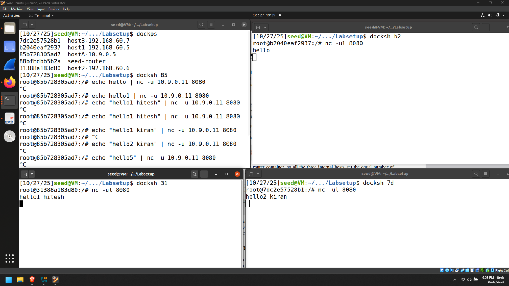

### With DROP Rule

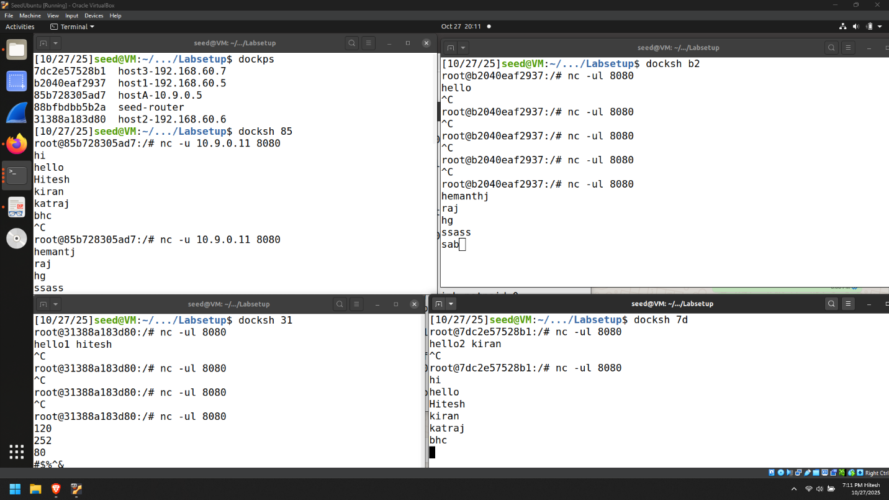

### Observation

- Initial packets are accepted.
- Excess packets are dropped after threshold.
- Rate limiting is strictly enforced.

---

# Load Balancing

## Round-Robin Distribution (nth Mode)

### Rules

```bash
iptables -t nat -A PREROUTING -p udp --dport 8080 \
-m statistic --mode nth --every 3 --packet 0 \
-j DNAT --to-destination 192.168.60.5:8080

iptables -t nat -A PREROUTING -p udp --dport 8080 \
-m statistic --mode nth --every 2 --packet 0 \
-j DNAT --to-destination 192.168.60.6:8080

iptables -t nat -A PREROUTING -p udp --dport 8080 \
-m statistic --mode nth --every 1 --packet 0 \
-j DNAT --to-destination 192.168.60.7:8080
```

### Screenshot

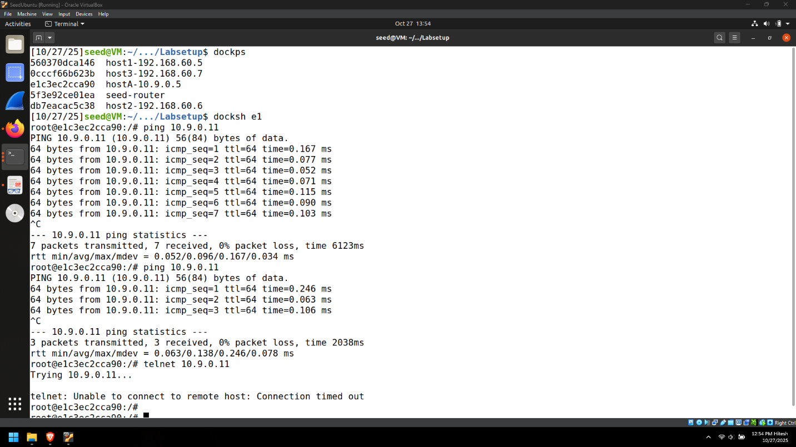

### Result

Traffic is distributed evenly:

| Server | Packets |
|----------|----------|
| 192.168.60.5 | 0,3,6,9 |
| 192.168.60.6 | 1,4,7,10 |
| 192.168.60.7 | 2,5,8,11 |

---

## Random Distribution Mode

### Rules

```bash
iptables -t nat -A PREROUTING -p udp --dport 8080 \
-m statistic --mode random --probability 0.33 \
-j DNAT --to-destination 192.168.60.5:8080

iptables -t nat -A PREROUTING -p udp --dport 8080 \
-m statistic --mode random --probability 0.50 \
-j DNAT --to-destination 192.168.60.6:8080

iptables -t nat -A PREROUTING -p udp --dport 8080 \
-j DNAT --to-destination 192.168.60.7:8080
```

### Screenshot

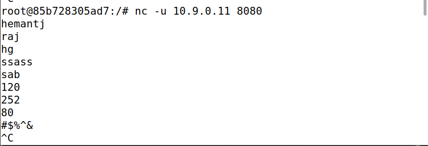

### Observation

- Packets are distributed randomly.
- Traffic reaches all backend servers.
- Distribution approximates a 1:1:1 ratio over time.

---

# Tools Used

- Linux
- iptables
- conntrack
- Netcat
- Docker Lab Environment
- TCP/IP Networking Utilities

---

# Key Takeaways

This lab demonstrates how modern firewalls enforce security policies using both stateless and stateful inspection techniques. Through practical exercises involving packet filtering, connection tracking, rate limiting, and load balancing, the lab provides foundational skills required for network defense and security operations.
